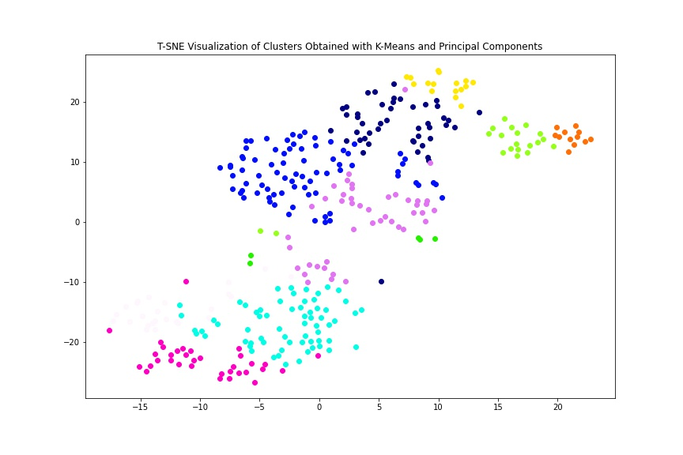

# PCA & K-Means Cluster Analysis of Personal IMDB Ratings
[<b>Notebook</b>](IMDB_Cluster_Analysis.ipynb) 
Data Source : IMDB Account.
### Objectives:
1. Attempting to Find patterns in <b>My IMDb movie Ratings </b>over a period of 5 Years, 345 Films.<b> Find insights about preferences etc., Important Features </b>Using (I) EDA (II) K-Means Clustering.
2. Find <b>Interesting Clusters of Movies Using K-Means Clustering</b>.
3. Use as many features as possible with feature engineering to add features, one-hot encoding categorical features like Genres, Directors etc. (~275 Features)
3. Use <b>Principal Component Analysis </b>to reduce dimensionality of data and improve Clustering output. (120 Features capturing 50% of the Variance of the data.)
4. Gathering Insights on preferences by performing <b>hypothesis testing on these clusters</b> with respect to mean Ratings. 

### Insights :

 <b>Statistically Significant Clusters </b>indicate that the author: 
1. Prefers - Prestige/lesser-known Dramas, Romantic/Comedic Dramas. 
2. Dislikes - Newer Action-Adventure, Sci-Fi, Superhero movies, Hindi Comedies. 
* It was also found that the IMDb rating, Popularity of movies were important positive features, whereas the year of release of a movie had an inverse relationship on the rating on the movie. 
* <b>Clusters are also formed of films by directors that the author</b> seems to prefer (high mean difference to the overall mean of ratings), These include films by Directors Satyajit Ray, Brad Bird, Andrew Stanton, Dean DeBlois, Edgar Wright, Steven Spielberg, Wes Anderson etc. 
* <b>Clusters of Directors that make longer than average movies</b> were also formed but were not found to have a relevant effect on the preference of the author. The clusters with the most positive deviation in popularity were of films by David Fincher, Christopher Nolan.
